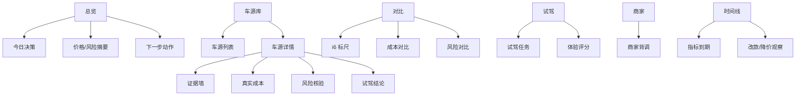

# NewCar V1.1 需求文档

## 版本目标

V1.1 将 NewCar 从“备选车记录工具”升级为“购车决策工作台”。核心目标不是收集更多车型参数，而是帮助用户判断每一台具体车源：

- 为什么便宜；
- 哪里接近理想 i6 的驾乘体验；
- 哪里存在二手新能源特有风险；
- 这个折价是否足以覆盖车况、权益、时间和后续持有成本。

## 用户画像

目标用户为北京新能源指标持有人，购车窗口明确，预算约 30 万，主要 2 人用车，后排需求弱，重视前排舒适、静谧性、底盘滤震、车机智能、长续航和外观内饰审美。

当前用户已试驾并认可理想 i6 的驾乘体验，希望寻找“接近 i6 体验，但价格更合理、二手风险可控”的车源。用户可接受二手车，尤其是平台担保、自营、官方认证、准新车，但对事故修复、权益不随车、BaaS 长期成本、商家承诺不透明非常敏感。

## 业务背景

北京新能源指标有效期为 12 个月，用户指标于 2026-05-26 下发，最晚应在 2027-05-26 前完成车辆登记。用户具备等待窗口，不需要立即购买，因此 App 需要支持长期跟踪价格、改款、车源变化和成交阈值。

新能源二手车的核心复杂度来自四类信息不对称：

- 车况：准新车也可能存在钣喷、底盘、电池包、展车/试驾车、退订车、公司户流转等问题。
- 权益：首任车主权益、官方认证权益、智驾/NOP+、换电/BaaS、三电质保是否随车不直观。
- 价格：二手报价、新车优惠、保险、运输、上牌、整备、订阅和月租共同决定真实成本。
- 主观体感：舒适、静谧、底盘、车机、外观内饰无法通过参数完全表达，需要试驾记录沉淀。

## 产品定位

NewCar V1.1 是一个本地优先的个人购车决策系统。

它不替代懂车帝、理想/蔚来官方 App、查博士或车商沟通，而是把这些信息统一沉淀为可比较、可追踪、可复盘的证据链。

## 成功指标

- 用户能在 3 分钟内录入一台新车源的核心信息。
- 每台车源都有明确状态：值得看、继续观察、等降价、压价捡漏、排除。
- 用户能一眼看到真实 3 年/5 年成本，而不是只看报价。
- 每台车源的风险提示都有原因和下一步核验问题。
- 试驾后能把主观体感转成可比较的分数和文字结论。
- 购车前能导出完整车源档案和核验清单。

## 版本范围

### P0 必做

1. 车源详情页
   - 从卡片进入完整档案页。
   - 展示基础信息、价格、权益、检测、证据、试驾、风险、下一步动作。
   - 支持状态标记：观察、已联系、已试驾、谈价、待复检、排除、已成交。

2. 真实成本计算器
   - 支持裸车价、新车参考价、预估落地价。
   - 支持保险、运输、上牌、整备、检测、延保等一次性成本。
   - 支持 BaaS/月租、智驾订阅、车联网订阅等周期成本。
   - 输出 1 年、3 年、5 年持有成本。

3. 风险规则库
   - 识别准新车过户、低价异常、无完整检测、权益不明、BaaS 长期成本、异地车源、车衣/改色、疑似修复项多。
   - 每条风险输出风险等级、触发原因、核验问题、压价依据。

4. 证据墙
   - 每台车可保存截图/图片 URL/备注。
   - 证据类型：车源页、配置单、检测报告、商家承诺、客服聊天、合同条款、权益截图、维修记录。
   - 支持“已核验 / 待核验 / 有冲突”状态。

5. i6 体感标尺
   - 每台车与理想 i6 对齐比较。
   - 维度：前排座椅、静谧性、底盘滤震、车机、智驾、高速稳定、停车便利、外观接受度、内饰高级感。
   - 输出：优于 i6、接近 i6、弱于 i6、未知。

### P1 应做

1. 商家背调档案
   - 记录商家名称、平台身份、城市、主体类型、承诺、是否官方认证、是否第三方车商。
   - 保存背调结论和历史沟通。

2. 价格观察
   - 记录价格历史、降价提醒、目标成交价。
   - 支持“价格太高 / 可谈 / 到价可看 / 到价可买”判断。

3. 核验问答模板
   - 按品牌和车源类型生成沟通问题。
   - 蔚来：电池产权、BaaS合同、NOP+、官方认证、换电权益、三电质保。
   - 理想：官方认证、维修记录、辅助驾驶权益、事故维修、保养和OTA状态。
   - 懂车帝自营：检测报告、7天退、60天保、终身回购条款、复检条件。

4. 试驾任务清单
   - 试驾前生成要重点体验的问题。
   - 试驾后录入评分、路线、速度、路况、噪音主观结论。

### P2 可后续做

1. 车源网页抓取辅助
   - 从 URL 自动提取标题、价格、里程、城市、图片。
   - 因页面登录态和反爬限制，先作为手动辅助，不作为 V1.1 阻塞项。

2. 多设备同步
   - 当前继续本地 localStorage + JSON 导入导出。
   - 后续可接入 GitHub Gist、Supabase 或自托管后端。

3. 成交复盘
   - 记录最终购买原因、成交价、砍价过程、复检结果。

## 信息架构



## 核心用户流程

### 新增车源

1. 用户点击“新增车源”。
2. 输入车型、版本、价格、城市、来源、链接。
3. 选择电池买断/BaaS、过户次数、检测报告类型。
4. 系统自动生成初始风险和待问问题。
5. 用户把车源加入“观察”。

### 评估具体二手车

1. 打开车源详情页。
2. 查看“为什么便宜”模块。
3. 补充证据截图和商家回复。
4. 使用真实成本计算器看 3 年/5 年成本。
5. 标记核验项状态。
6. 得到建议：值得看、继续观察、压价、排除。

### 试驾后复盘

1. 选择车源并打开试驾任务。
2. 按 i6 标尺评分。
3. 记录不舒服/惊喜/不能接受点。
4. 系统更新综合匹配分。

### 购车前最终检查

1. 进入车源详情。
2. 查看所有高风险项是否关闭。
3. 查看合同和平台保障证据是否齐全。
4. 导出核验清单。

## 数据模型草案

```js
{
  car: {
    id,
    name,
    trim,
    stage,
    recommendation, // worthViewing, watch, waitDrop, bargainOnly, reject
    url,
    price,
    newPrice,
    targetPrice,
    landingEstimate,
    city,
    sourceType,
    sellerId,
    battery: {
      mode, // buyout, baas, unknown
      sizeKwh,
      monthlyFee,
      ownershipEvidenceId
    },
    rights: {
      adasStatus, // included, notIncluded, subscription, unknown
      officialCertified,
      warranty,
      exchangeRights,
      evidenceIds
    },
    condition: {
      mileage,
      plateDate,
      transfers,
      paint,
      repairs,
      batteryHealth,
      reportType,
      reportEvidenceId
    },
    experience: {
      baseline: "理想 i6",
      seat,
      nvh,
      chassis,
      cockpit,
      adas,
      highway,
      parking,
      exterior,
      interior
    },
    costs: {
      insurance,
      transport,
      inspection,
      reconditioning,
      subscriptions,
      years3,
      years5
    },
    notes,
    createdAt,
    updatedAt
  }
}
```

## 风险规则示例

| 规则 | 触发条件 | 风险等级 | 输出 |
|---|---|---|---|
| 准新车过户 | 上牌 <= 6 个月且过户 > 0 | 高 | 追问展车/试驾车/公司户/退订车/抵押流转 |
| 折价异常 | 准新买断车折价 > 22% | 高 | 要求解释来源、完整检测、维修记录 |
| 检测不足 | 仅基础检测或无报告 | 中/高 | 要求第三方复检和底盘/电池包检查 |
| 权益不明 | NOP+/智驾/官方认证未知 | 中 | 要求官方 App 截图或客服书面确认 |
| BaaS 长期成本 | 月租 > 0 | 中 | 自动计算 3/5 年总成本和转售影响 |
| 异地车源 | 城市非北京 | 低/中 | 核验转籍、运输、临牌、上牌流程 |
| 车衣/改色 | 外观包含车衣、改色、颜色变更 | 中 | 检查膜下漆面、登记证颜色、边角拆装 |
| 体感不匹配 | i6 标尺多项弱于 i6 | 中 | 仅在价格明显低时保留 |

## 排除规则

以下情况建议直接进入排除，除非价格极低且用户明确愿意承担风险：

- 三电、电池包、底盘存在不清晰维修记录；
- 商家拒绝提供完整检测或拒绝第三方复检；
- 重大事故、水泡、火烧、调表疑点无法排除；
- 权益承诺无法以合同、官方截图或平台规则固化；
- 车源价格接近新车优惠后价格，但失去新车权益；
- 试驾后核心体感明显弱于 i6，且没有足够价格补偿。

## MVP 验收清单

- 可新增/编辑车源详情。
- 可录入证据并绑定到车源。
- 可计算 1/3/5 年真实成本。
- 可展示风险规则触发原因。
- 可按 i6 标尺评分。
- 可从车源详情导出核验清单。
- 移动端可顺畅查看和录入。

## 非目标

- 不做泛汽车资讯门户。
- 不做公开车源交易平台。
- 不在 V1.1 承诺自动抓取所有车源字段。
- 不代替第三方检测或法律合同审核。
- 不做多人协作。

