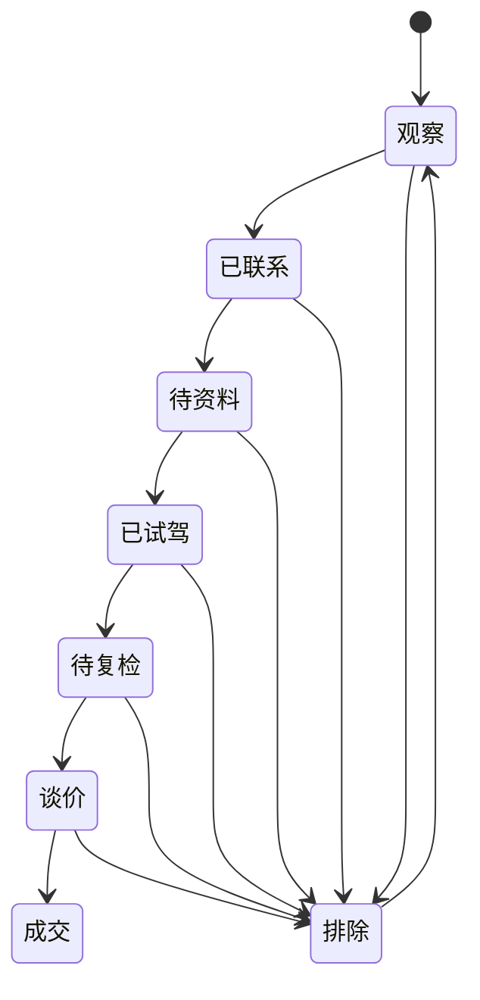
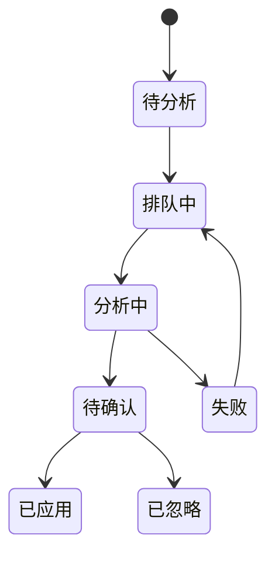
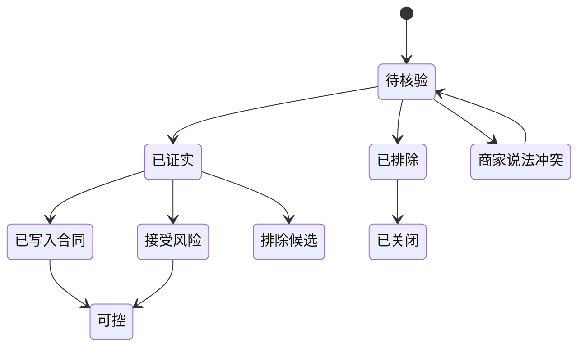

# NewCar V1.2 交互逻辑与界面设计

日期：2026-06-02

## 0. 版本设计目标

V1.2 的界面不再围绕“车源卡片 + 参数对比”展开，而是围绕一条完整购车工作流：

```text
画像确认 -> 发现新车/二手车源 -> 加入候选尽调 -> 上传信息墙 -> AI 提取与回填 -> 关闭风险 -> 试驾复盘 -> 谈价/等待/购买
```

设计目标：

- 让用户始终知道“我现在在哪一步、下一步该做什么”。
- 新车观察和二手车源尽调分开，不再混淆“车型”和“具体车源”。
- 每条风险都有证据、状态和下一步，不停留在泛泛提醒。
- 信息墙从“记录区”升级为“AI 结构化输入区”。
- 三电与长期质量要成为独立判断维度，并清楚展示数据来源可信度。
- 移动端优先支持真实使用场景：看懂车帝截图、传微信截图、标记风险、联系商家、试驾后记录。

## 1. 设计原则

### 1.1 流程优先，不是页面优先

页面应该回答用户在购车流程中的具体问题：

- 总览：今天该做什么？
- 画像：系统现在按什么偏好判断？
- 新车观察：哪些车型值得等、值得试驾？
- 二手车源：哪些具体车源值得加入尽调？
- 候选尽调：每台车还有哪些风险没关闭？
- 单车详情：这台车为什么值得/不值得继续？
- 信息墙：截图、聊天、报告里有什么可用事实？
- 风险闭环：哪些红线仍然不能放过？
- 质量档案：这款车的三电和长期质量口碑可靠吗？

### 1.2 主对象必须分清

V1.2 有四类主对象：

| 对象 | 含义 | 典型页面 |
|---|---|---|
| 用车画像 | 用户长期偏好和排除项 | 画像页、总览摘要 |
| 新车车型 | 车系/版本/权益/上市节点 | 新车观察 |
| 二手车源 | 可联系、可检测、可谈价的一台车 | 二手车源、候选尽调 |
| 证据 | 截图、链接、报告、聊天、试驾记录 | 信息墙、风险闭环 |
| 质量数据 | 投诉销量比、召回、质量研究、SOH/维保 | 质量档案、单车详情、对比 |

任何卡片和详情页都要明确标注对象类型。新车卡片不展示“车况风险”，二手车源卡片必须展示“车况/权益/商家风险”。

### 1.3 AI 结果要可确认

AI 不直接覆盖用户数据。所有 AI 回填都走：

```text
上传/输入 -> 分析任务 -> 字段提取结果 -> 用户确认 -> 应用到候选 -> 更新风险/成本/待办
```

### 1.4 高风险必须变成动作

每条高风险卡片必须包含：

- 为什么触发；
- 需要什么证据；
- 当前证据状态；
- 下一步问谁；
- 是否已写进合同；
- 用户是否接受此风险。

### 1.5 质量数据必须可追溯

三电和长期质量不能只给一个黑盒分数。界面需要同时展示：

- 数据源名称；
- 数据更新时间；
- 样本口径；
- 可信度等级；
- 对当前候选的影响；
- 下一步需要补什么证据。

可信度默认排序：

```text
单车 SOH/维保/故障码 > 官方召回/缺陷调查 > 投诉销量比 > 第三方质量研究 > 论坛/媒体口碑
```

当数据源互相矛盾时，显示“证据冲突”，并把它变成待关闭风险。

## 2. 总体信息架构

### 2.1 桌面导航

左侧主导航建议调整为：

1. 总览
2. 用车画像
3. 新车观察
4. 二手车源
5. 候选尽调
6. 对比
7. 试驾
8. 商家
9. 报告

说明：

- “候选库”改名为“候选尽调”，强调这里不是收藏夹，而是尽调工作台。
- “风险”不再作为孤立主导航页，而是进入候选详情和总览的待办中；如果保留风险页，应改为“待关闭风险”。
- “新车情报”改名为“新车观察”，强调长期跟踪车型、版本、权益、改款。
- “二手车”改名为“二手车源”，强调这里是具体车源。
- “报告”用于最终导出和购买前红线检查。

### 2.2 移动端导航

移动端底部 Tab 控制在 5 个以内：

1. 总览
2. 发现
3. 尽调
4. 试驾
5. 更多

移动端映射：

| Tab | 包含 |
|---|---|
| 总览 | 今日结论、待办、指标倒计时 |
| 发现 | 新车观察、二手车源 |
| 尽调 | 候选阶段看板、单车详情、风险闭环 |
| 试驾 | 试驾任务、试驾复盘 |
| 更多 | 画像、商家、报告、导入导出、账号 |

这样可以避免底部 8 个 Tab 太挤，同时保留当前最常用流程。

### 2.3 推荐信息架构图

```mermaid
flowchart TD
  A["总览"] --> A1["今日结论"]
  A --> A2["待关闭风险"]
  A --> A3["到价/改款提醒"]
  A --> A4["下一步动作"]

  B["用车画像"] --> B1["当前画像"]
  B --> B2["画像历史"]
  B --> B3["刷新策略"]

  C["新车观察"] --> C1["重点车型池"]
  C --> C2["近期发布/热门车型"]
  C --> C3["权益/改款事件"]
  C --> C4["加入新车候选"]

  D["二手车源"] --> D1["懂车帝官方/自营"]
  D --> D2["个人直卖"]
  D --> D3["第三方商家"]
  D --> D4["加入候选尽调"]

  E["候选尽调"] --> E1["阶段看板"]
  E --> E2["列表视图"]
  E --> E3["单车详情"]

  E3 --> F["信息墙"]
  E3 --> G["风险闭环"]
  E3 --> H["真实成本"]
  E3 --> I["价格观察"]
  E3 --> J["质量档案"]
  E3 --> K["试驾复盘"]
  E3 --> N["合同/核验清单"]

  L["商家"] --> L1["商家档案"]
  L --> L2["承诺清单"]
  L --> L3["关联车源"]

  M["报告"] --> M1["最终决策报告"]
  M --> M2["红线项检查"]
```



## 3. 核心交互流程

### 3.1 用车画像流程

目标：所有推荐、刷新、排序、风险权重都有共同基准。

流程：

1. 用户进入“用车画像”。
2. 页面展示当前画像摘要：
   - 2 人用车；
   - 北京；
   - 预算 24-31 万；
   - 纯电优先；
   - 续航 650km+；
   - 舒适/NVH/车机/高速智驾优先；
   - 理想 i6 为体验标尺；
   - 排除项。
3. 用户点“编辑画像”进入表单。
4. 保存时生成一条画像版本记录：
   - 修改时间；
   - 修改字段；
   - 修改原因；
   - 是否作为默认刷新画像。
5. 新车/二手刷新按钮旁显示“使用画像：北京 · 24-31 万 · 纯电 · i6 标尺”。

关键界面：

- 当前画像卡；
- 画像编辑抽屉；
- 画像版本时间线；
- 画像影响说明：本画像会影响新车排序、二手车过滤、风险权重、试驾任务。

### 3.2 新车观察流程

目标：帮用户观察车型，而不是评估具体车况。

流程：

1. 进入“新车观察”。
2. 顶部展示重点车型池：
   - 理想 i6；
   - 蔚来 ES6；
   - 极氪 7X；
   - 小鹏 GX；
   - 007GT；
   - Q6L e-tron；
   - 用户手动关注车型。
3. 用户点击“刷新车型信息”。
4. 系统从懂车帝和补充信源获取近期发布/热门车型，再按画像筛选。
5. 页面分为三栏或三段：
   - 当前值得重点观察；
   - 即将上市/刚上市；
   - 暂不适合但需关注。
6. 点击车型进入“车型观察详情”：
   - 版本与价格；
   - 权益/交付/试驾车到店；
   - 改款风险；
   - 和 i6 的预期差异；
   - 加入新车候选。

卡片层级：

1. 车型名 + 适配度；
2. 价格区间 + 续航/电池；
3. 上市/改款/权益事件；
4. 为什么适合或为什么暂缓；
5. 主操作：加入新车候选；
6. 次操作：车型页、上市资讯。

### 3.3 二手车源流程

目标：帮用户从具体车源中筛出值得尽调的车。

流程：

1. 进入“二手车源”。
2. 顶部显示数据来源和筛选画像：
   - 城市；
   - 车源类型；
   - 能源过滤；
   - 预算区间；
   - 重点车型。
3. 用户点击“刷新官方/自营车源”或切换“个人/第三方”。
4. 车源卡片按“值得先看”排序。
5. 用户点击“加入尽调”。
6. 系统把车源转换为候选尽调对象，并自动生成：
   - 初始风险；
   - 下一步问题；
   - 真实成本初算；
   - 商家档案。
   - 三电/长期质量待核验项。

二手车源卡片必须展示：

- 车源类型：懂车帝官方/自营、个人直卖、第三方商家；
- 城市；
- 报价；
- 新车同配置参考；
- 年份/里程/过户；
- 电池买断/BaaS；
- 检测/保障标签；
- 三电质量摘要：投诉销量比、召回、SOH 是否缺失；
- 风险摘要；
- 主操作：加入候选尽调。

### 3.4 候选尽调流程

目标：把候选车从“收藏列表”变成“工作流”。

视图设计：

- 默认：阶段看板；
- 可切换：紧凑列表；
- 可筛选：新车/二手、风险、阶段、商家、买断/BaaS、是否到价。

阶段列：

1. 观察；
2. 已联系；
3. 待资料；
4. 已试驾；
5. 待复检；
6. 谈价；
7. 排除；
8. 成交。

候选卡片层级：

1. 车型 + 版本；
2. 推荐状态；
3. 尽调完成度；
4. 未关闭高风险数；
5. 当前价格/目标价；
6. 下一步动作；
7. 主操作：打开详情。

拖拽或菜单移动阶段：

- 移动到“待资料”时自动生成资料清单；
- 移动到“已试驾”时提示补试驾复盘；
- 移动到“谈价”时提示目标价和未关闭风险；
- 移动到“成交”前触发红线项检查。

### 3.5 单车详情流程

目标：所有关于一台车的事实、判断、风险、成本和动作集中在这里。

桌面布局：

- 顶部：车名、阶段、建议、主操作；
- 左侧主列：基础档案、信息墙、真实成本、价格观察、i6 标尺、试驾记录；
- 右侧固定决策栏：风险分、质量可信度、尽调完成度、未关闭红线、下一步动作、目标价；
- 底部或右侧：导出核验清单。

移动端布局：

- 顶部吸附摘要：
  - 车名；
  - 阶段；
  - 风险；
  - 下一步；
  - 快捷按钮：上传信息、标记风险、联系商家。
- 内容用页内 Tab：
  - 概览；
  - 信息墙；
  - 风险；
  - 质量；
  - 成本；
  - 试驾；
  - 价格；
  - 合同。

### 3.6 信息墙与 AI 回填流程

目标：用户只需要把信息丢进来，系统帮忙提炼、回填和追问。

流程：

1. 用户上传图片/截图/报告，或输入一段文字。
2. 页面新增一条“待分析”信息卡。
3. AI 任务开始后显示进度：
   - 排队中；
   - 分析中；
   - 待确认；
   - 已应用；
   - 失败可重试。
4. 分析完成后弹出“字段回填预览”：
   - 左侧：识别出的字段；
   - 右侧：当前值 -> 建议值；
   - 每个字段可勾选是否应用；
   - 风险/问题作为单独区块展示。
5. 用户确认后：
   - 更新车辆字段；
   - 更新风险列表；
   - 更新真实成本；
   - 增加下一步动作；
   - 记录分析历史。

信息墙卡片内容：

- 缩略图；
- 信息类型；
- 分析状态；
- 关联风险；
- 提取字段数；
- 上传时间；
- 操作：查看、重新分析、应用结果、删除。

### 3.7 风险闭环流程

目标：风险不只是提示，而是可以关闭、接受或写进合同。

风险状态：

| 状态 | 含义 | 主操作 |
|---|---|---|
| 待核验 | 系统或用户发现，但无证据 | 要求证据 |
| 已证实 | 风险确认存在 | 接受/排除/压价 |
| 已排除 | 证据证明风险不存在 | 关闭 |
| 商家说法冲突 | 不同信息源矛盾 | 继续追问 |
| 已写入合同 | 风险或承诺已经合同化 | 标记可控 |
| 接受风险 | 用户愿意承担 | 记录理由 |

风险卡片必须展示：

- 风险等级；
- 风险标题；
- 触发原因；
- 当前状态；
- 关联证据；
- 核验问题；
- 压价依据；
- 主操作按钮。

详情页和总览中的“可买”判断规则：

- 仍有未关闭高风险：不能显示“可买”，只能显示“资料未闭环”。
- 中风险可接受但必须有用户理由。
- 已写入合同的风险可以降权。

### 3.8 价格与改款观察流程

目标：支撑用户从 2026-06 观察到 2027-05。

核心界面：

- 价格阈值条：
  - 当前价；
  - 目标价；
  - 可看价；
  - 可买价；
  - 新车权益价；
  - 3 年真实成本。
- 价格事件时间线：
  - 报价变化；
  - 平台降价；
  - 新车权益变化；
  - 改款/新增版本；
  - 试驾车到店；
  - 交付节奏变化。

交互规则：

- 二手报价接近新车权益价时，显示“二手优势不足”。
- 准新二手折价异常时，显示“便宜原因必须解释”。
- 到达目标价但高风险未关闭，仍不能提示“可买”。

### 3.9 三电与长期质量评估流程

目标：让用户在体验和价格之外，清楚知道一辆电车的长期可靠性证据是否足够。

入口：

- 新车观察卡片：显示“质量数据待观察/已有初期质量数据/存在召回或集中投诉”。
- 二手车源卡片：显示“SOH 缺失”“三电质保待确认”“车系投诉销量比偏高”等标签。
- 单车详情页：新增“质量”页内 Tab。
- 对比页：新增“质量与三电”对比维度。

流程：

1. 用户进入候选详情，打开“质量”Tab。
2. 系统展示两层信息：
   - 车系级质量：投诉销量比、三电投诉占比、召回、第三方质量研究、口碑趋势；
   - 单车级证据：SOH、维保记录、故障码、电池包/电驱/电控维修、三电质保权益。
3. 用户点击“AI 检索质量线索”：
   - 拉取/更新可用公开线索；
   - 记录数据源、核验状态和更新时间；
   - 标记事实字段和单车证据缺口。
4. 系统生成“质量核验清单”：
   - 向商家索要 SOH/电池健康度；
   - 索要 4S 维保和三电故障记录；
   - 确认三电质保是否随车；
   - 复检读取故障码和电池一致性；
   - 核对是否存在同车型集中投诉。
5. 用户上传 SOH/维保/检测截图后，AI 提取并更新单车级证据。
6. 若车系级数据偏差或单车证据缺失，系统自动生成待关闭风险。

质量页结构：

- 顶部结论条：
  - 质量可信度：高/中/低/未知；
  - 三电风险：低/中/高；
  - 单车证据完整度；
  - 最关键缺口。
- 数据源卡片：
  - 官方召回；
  - 车质网投诉销量比；
  - J.D. Power/第三方研究；
  - 车主口碑/论坛；
  - 单车 SOH/维保/故障码。
- 三电问题分布：
  - 动力电池；
  - 电机；
  - 电控；
  - 充电；
  - 续航衰减；
  - 无法上电/动力受限；
  - 热管理。
- 质量核验清单：
  - 每项可标记为待要资料、已收到、证据不足、已关闭。

交互规则：

- 没有单车 SOH/维保记录时，二手车不得显示“质量证据充分”。
- 官方召回不等于不可买，但必须显示召回原因、覆盖范围和是否已处理。
- 投诉销量比高于同级中位数时，候选排序降权，并生成解释。
- 论坛口碑只能作为线索，不作为最终结论。
- 数据源过期超过 30 天时显示“建议刷新”。
- 最终报告必须包含质量数据来源和未关闭质量风险。

移动端表现：

- 质量 Tab 先显示 3 张关键卡：质量结论、单车证据缺口、下一步要资料。
- 数据源详情默认折叠，避免手机屏幕过长。
- “向商家要资料”按钮可一键复制问题清单。

### 3.10 试驾流程

目标：让主观体感可比较。

试驾前：

- 系统基于该车风险自动生成任务；
- 用户可选择路线类型：
  - 城市通勤；
  - 快速路；
  - 高速；
  - 破损路面；
  - 地库/窄路停车。

试驾后：

- 每项评分必须配一句说明；
- 支持“相对 i6”选择：
  - 明显优于；
  - 接近；
  - 略弱；
  - 不能接受；
  - 未体验。
- 保存后更新 i6 相似度和候选排序。

## 4. 关键页面设计

### 4.1 总览页

目标：打开即知道今天该做什么。

模块：

1. 今日结论
   - 当前最值得继续看的车；
   - 当前最应该等待的车；
   - 当前应排除的车。
2. 指标和时间窗口
   - 距 2027-05-26 还有多少天；
   - 当前建议节奏：先观察/可试驾/可谈价。
3. 待关闭风险
   - 高风险优先；
   - 每条风险有目标车和下一步。
4. 到价/改款提醒
   - 哪台二手到目标价；
   - 哪个新车可能近期权益变化。
5. 今日动作
   - 要问商家的 3 个问题；
   - 要上传的 2 张截图；
   - 要安排的 1 个试驾。
6. 质量提醒
   - 哪台车三电/长期质量数据缺口最大；
   - 哪台车需要补 SOH、维保或三电质保证据；
   - 哪个车系的投诉销量比、召回或集中投诉需要重点解释。

视觉：

- 总览不使用大面积图片；
- 以高密度但清晰的工作台布局为主；
- 重要行动用主色按钮；
- 高风险用红色左边框而不是整块红背景。

### 4.2 用车画像页

模块：

- 当前画像摘要；
- 偏好权重；
- 明确排除项；
- i6 标尺说明；
- 画像历史；
- 影响范围说明。

交互：

- 编辑画像用右侧抽屉或移动端底部弹层；
- 保存时要求填写“为什么修改”，默认可选：
  - 试驾后调整；
  - 预算变化；
  - 更倾向二手；
  - 排除某车型；
  - 时间窗口变化。

### 4.3 新车观察页

模块：

- 重点车型池；
- 近期发布；
- 热门纯电；
- 权益/改款事件；
- 暂缓观察区。

卡片样式：

- 图片为辅助，不占第一视觉；
- 重点展示：
  - 适配画像原因；
  - 价格/续航；
  - 三电与长期质量状态；
  - 上市/改款/权益状态；
  - 下一步：等试驾、等权益、加入候选。

### 4.4 二手车源页

模块：

- 数据源控制；
- 筛选画像；
- 官方/自营车源；
- 个人直卖；
- 第三方商家；
- 加入尽调。

卡片样式：

- 用“车源类型 + 风险 + 价格距离”作为视觉第一层；
- 增加“质量证据”一行，优先显示 SOH、维保、三电质保是否齐全；
- 对缺少 SOH、维保、三电质保证据的二手电车显示待核验标签；
- 图片放在上方或左侧，但不要盖过尽调信息；
- 卡片底部只保留 2 个主操作：
  - 加入尽调；
  - 打开外部详情。

### 4.5 候选尽调页

默认阶段看板：

- 每列是阶段；
- 每张卡是候选；
- 卡片显示尽调完成度和未关闭风险；
- 可切换紧凑列表。

顶部：

- 新车/二手/全部分段控件；
- 风险筛选；
- 质量可信度筛选；
- 到价筛选；
- 搜索。

空状态：

- 没有候选时，不展示空白表格；
- 展示两个入口：
  - 去新车观察找车型；
  - 去二手车源找具体车。

### 4.6 单车详情页

页内结构：

1. 概览
   - 建议；
   - 阶段；
   - 尽调完成度；
   - 下一步；
   - 价格/目标价；
   - 红线项。
2. 信息墙
   - 上传；
   - 分析任务；
   - 字段回填；
   - 信息卡片。
3. 风险
   - 风险状态机；
   - 证据绑定；
   - 商家问题；
   - 合同化。
4. 质量
   - 质量可信度；
   - 车系投诉销量比；
   - 三电投诉关键词；
   - 官方召回/缺陷记录；
   - 单车 SOH/维保/故障码；
   - 三电质保权益；
   - 质量核验清单。
5. 成本
   - 3 年/5 年；
   - BaaS；
   - 智驾订阅；
   - 检测/运输/保险。
6. 价格
   - 当前价；
   - 目标价；
   - 历史；
   - 新车权益对照。
7. 试驾
   - 任务；
   - 复盘；
   - i6 相似度。
8. 合同
   - 必须写入条款；
   - 已有承诺；
   - 未确认承诺。

### 4.7 商家页

模块：

- 商家列表；
- 商家详情；
- 关联车源；
- 承诺清单；
- 背调记录；
- 风险分布。

商家详情要突出：

- 这是谁；
- 和平台/品牌是什么关系；
- 卖过/正在卖哪些车；
- 哪些承诺没有证据；
- 是否支持复检和合同化。

### 4.8 报告页

目标：最终决策前复盘。

模块：

- 最终候选排序；
- 每台车保留/排除理由；
- 未关闭风险；
- 三电与长期质量证据；
- 价格和成本；
- 已收集证据；
- 要写进合同的条款；
- 导出 Markdown/PDF。

报告中的质量部分必须包含：

- 车系级数据源；
- 投诉销量比和三电投诉关键词；
- 召回/缺陷记录；
- 单车级 SOH、维保、故障码和三电质保状态；
- 仍未关闭的质量风险；
- 是否建议把三电质保、故障码清零、SOH 下限写入合同。

## 5. 状态机设计

### 5.1 候选阶段状态机



阶段迁移提示：

- 进入“待资料”：自动列出缺失证据。
- 进入“已试驾”：要求补试驾复盘。
- 进入“谈价”：显示目标价、红线项和压价依据。
- 进入“成交”：强制检查未关闭高风险。

### 5.2 AI 分析任务状态机



关键规则：

- 失败不删除原始信息；
- 待确认结果不自动改字段；
- 已应用后可查看修改历史；
- 用户可撤销最近一次应用。

### 5.3 风险状态机



## 6. 移动端设计规则

### 6.1 移动端优先任务

手机上最常发生的动作：

- 上传懂车帝截图；
- 上传微信聊天截图；
- 查看下一步问题；
- 标记风险状态；
- 试驾后快速记录；
- 打开外部车源；
- 联系商家。

### 6.2 移动端布局规则

- 底部 Tab 只保留 5 个入口；
- 单车详情使用顶部吸附摘要 + 页内分段 Tab；
- 阶段看板在手机上改成横向阶段条 + 当前阶段列表；
- 风险卡片不做复杂表格；
- 价格历史可用简化时间线；
- 上传按钮保持在详情页信息墙顶部和浮动快捷入口。

### 6.3 移动端按钮层级

每个页面最多一个主按钮：

- 总览：处理今日待办；
- 发现：刷新/找车；
- 尽调：新增候选或打开当前最急候选；
- 单车详情：上传信息；
- 信息墙：应用 AI 回填；
- 风险：关闭/更新风险状态；
- 试驾：保存复盘。

## 7. 视觉语言

### 7.1 视觉方向

关键词：

- 冷静；
- 可信；
- 扫描效率高；
- 信息密度适中；
- 不像营销页；
- 不做花哨装饰。

### 7.2 色彩

沿用当前色系，但更明确语义：

- 主色：深青绿，用于主操作和可信结论；
- 风险红：只用于高风险点、红线项；
- 等待橙：用于中风险、待确认、价格未到；
- 信息蓝：用于新车事件、AI 分析、外部来源；
- 中性灰：用于辅助信息、未完成项。

### 7.3 卡片规则

- 卡片半径继续控制在 8px 左右；
- 页面区块不要嵌套多层卡片；
- 工作流卡片以文本和状态为主，图片为辅；
- 风险卡片使用左边框和标签，不用大面积红底；
- 空状态要给出下一步入口。

### 7.4 数据展示规则

- 数字要有语义标签，不裸露参数；
- 真实成本和目标价优先于指导价；
- 风险分必须配风险等级和未关闭数量；
- i6 标尺必须同时展示分数和文字解释；
- 任何“值得看”都要有理由。

## 8. 关键组件

### 8.1 当前画像条

用于所有刷新型页面顶部。

内容：

- 北京；
- 24-31 万；
- 纯电；
- 650km+；
- i6 标尺；
- 排除项数量。

操作：

- 查看画像；
- 编辑画像；
- 使用其他画像版本刷新。

### 8.2 尽调完成度

显示方式：

- 进度条或 7 段 Checklist；
- 维度：价格、车况、权益、商家、试驾、合同、复检；
- 未完成项可点击进入对应模块。

### 8.3 风险卡片

结构：

- 风险等级；
- 标题；
- 状态；
- 触发原因；
- 需要证据；
- 关联证据；
- 主操作。

### 8.4 质量可信度卡片

用于新车观察、二手车源、候选详情和对比页。

内容层级：

1. 顶部结论：
   - 质量可信度：高/中/低/未知；
   - 三电风险：低/中/高；
   - 单车证据完整度；
   - 最近更新时间。
2. 数据源芯片：
   - 官方召回；
   - 投诉销量比；
   - 第三方质量研究；
   - 车主口碑；
   - SOH/维保/故障码。
3. 关键解释：
   - 哪个数据源最强；
   - 哪个证据缺口最大；
   - 对候选排序的影响。
4. 主操作：
   - AI 检索质量线索；
   - 补单车证据；
   - 生成问商家清单。

视觉规则：

- 不用仪表盘式大圆环，避免显得像营销评分；
- 使用横向可信度条 + 数据源标签；
- A/B/C/D 数据源用文字说明，不只用颜色；
- “未知”必须是中性灰，不要伪装成低风险。

### 8.5 质量数据源说明弹层

用户点击质量卡片上的“数据说明”后打开。

弹层内容：

- 数据源可靠性排序；
- 每个数据源的优势和局限；
- 当前候选缺少哪些数据；
- 为什么某些口碑信息只作为线索；
- 买二手电车时必须补的单车级证据。

默认文案：

> 车系级数据只能说明这款车的公开口碑和集中问题，不能替代这台车本身的 SOH、维保和故障码检查。没有单车级证据时，系统不会把质量风险标为已关闭。

### 8.6 AI 回填预览

结构：

- 来源信息；
- 字段变更列表；
- 新增风险；
- 新增问题；
- 更新成本；
- 勾选应用。

### 8.7 价格阈值条

结构：

- 当前价；
- 目标价；
- 可看价；
- 可买价；
- 新车权益价；
- 价格结论。

### 8.8 红线项检查

用于成交前或报告页。

必须检查：

- 高风险是否关闭；
- 完整检测是否具备；
- 权益是否官方确认；
- 三电质量证据是否足够；
- 商家承诺是否合同化；
- 价格是否足够覆盖风险；
- 试驾是否通过。

## 9. 线框稿说明

本设计对应的静态线框稿：

- `docs/v1.2-wireframe.html`

线框稿重点展示：

- 桌面端总览；
- 候选尽调阶段看板；
- 单车详情；
- 信息墙 AI 回填；
- 风险闭环；
- 移动端 5 Tab 结构。

## 10. 下一步实现建议

建议按以下顺序进入实现：

1. 数据模型先补齐：
   - `investigationProgress`
   - `riskItems.status`
   - `evidence.analysisStatus`
   - `priceEvents`
   - `profileVersions`
   - `qualityProfile`
   - `qualitySources`
   - `qualityEvidence`
   - `threeElectricRisks`
2. 候选尽调页改造：
   - 阶段看板；
   - 紧凑列表；
   - 完成度。
3. 信息墙分析改造：
   - 分析任务状态；
   - 回填预览；
   - 结果应用。
4. 风险闭环改造：
   - 风险状态；
   - 绑定证据；
   - 关闭/接受/合同化。
5. 价格观察和报告页：
   - 价格阈值；
   - 事件时间线；
   - 红线项检查；
   - 导出报告。
