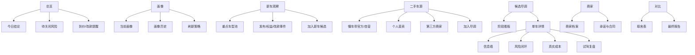

# NewCar V1.2 用户需求调研与需求分析

日期：2026-06-02

## 0. 结论摘要

V1.2 不应继续把 NewCar 做成“车型参数对比工具”。它真正要解决的是一个更具体的问题：

> 在北京新能源指标有效期内，帮助用户长期跟踪新车、准新二手车和具体车源，用证据和可执行核验流程降低买错车、买贵车、踩权益坑的概率。

本轮调研显示，用户的核心需求已经从“推荐一辆车”升级为“构建一个购车决策系统”。下一版应围绕五个关键词展开：

1. **画像驱动**：所有新车、二手车、风险、对比和试驾任务都应从同一份可保存、可修改的用车画像出发。
2. **新车/二手分流**：新车是“车型与版本观察”，二手是“具体车源尽调”，两者不能混在一个逻辑里。
3. **证据闭环**：截图、检测报告、聊天记录、配置单、权益截图和试驾记录都要能进入信息墙，并由 LLM 提取、回填、追问。
4. **质量底座**：三电可靠性、长期质量口碑和投诉销量比必须成为候选排序和最终建议的硬指标。
5. **行动导向**：系统不能只告诉用户“风险高”，还要告诉用户今天该问谁、要什么截图、是否值得试驾、是否该等降价。

建议 V1.2 版本主题：

> **可信购车作战台：从发现车源到核验、试驾、谈价的闭环。**

## 1. 研究依据

### 1.1 内部研究材料

- 本项目当前实现：总览、候选库、新车情报、二手车、对比、试驾、风险、商家、信息墙、Gemini/DeepSeek 分析、懂车帝数据服务。
- 已有文档：
  - `docs/v1.1-prd.md`
  - `docs/v1.1-interaction-visual-design.md`
  - `docs/local-data-services.md`
- 本轮长对话中的真实行为链路：
  - 从 30 万左右新能源新车推荐开始；
  - 逐步排除智界 R7、阿维塔 06T、YU7 等主观不喜欢或智驾不足车型；
  - 重点比较理想 i6、蔚来 ES6/ES8、极氪 7X、007GT、奥迪 Q6L e-tron、小鹏 GX、智己 LS6；
  - 重点转向懂车帝官方/自营/个人直卖/第三方车商二手车；
  - 反复追问蔚来 BaaS、NOP+、二手车主权益、官方认证、检测报告、商家背调、准新车过户和修复痕迹；
  - 最终提出构建 App 来辅助整个购车流程。

### 1.2 外部桌面研究

- 北京小客车指标规则：北京市政府公开文件明确“小客车指标有效期为 12 个月，不得转让”；首都之窗也提示更新指标有效期同为 12 个月。来源：[北京市小客车数量调控暂行规定](https://www.beijing.gov.cn/zhengce/zhengcefagui/202012/t20201206_2157922.html)、[首都之窗指标到期提醒](https://www.beijing.gov.cn/fuwu/bmfw/sy/jrts/tzxx/202411/t20241113_3940354.html)。
- 二手车交易痛点：中消协专题报告指出汽车消费投诉呈现复杂化，二手车常见问题包括隐瞒维修记录、事故记录、泡水信息、调低里程等；也建议消费者要求完整真实车况信息、正式合同并保留凭证。来源：[中国消费者协会汽车投诉情况专题报告相关报道](https://m.cqn.com.cn/pp/content/2023-05/11/content_8937814.htm)、[中国质量新闻网报道](https://m.cqn.com.cn/ms/content/2023-05/08/content_8936456.htm)。
- 二手车市场趋势：2025 年全国二手车交易规模突破 2000 万辆，新能源二手车全年交易量约 160 万辆，占比约 7.9%，跨区域流通持续强化。来源：[人民日报：二手车交易规模超2000万辆](https://paper.people.com.cn/rmrb/pad/content/202601/18/content_30133379.html)。
- 新能源二手车增长：汽车流通协会周报提到新能源二手车交易增长较快，2025 年 1 月新能源乘用车单月交易量突破 9 万辆。来源：[中国汽车流通协会周度快报](https://www.cada.cn/Data/info_86_10222.html)。
- 新能源电池安全新标准：工信部组织制定的强制性国家标准 GB 38031-2025 将于 2026-07-01 实施。来源：[中国政府网：电动汽车用动力蓄电池新国标出台](https://www.gov.cn/lianbo/bumen/202504/content_7019269.htm)。
- 懂车帝汽车商城保障口径：公开报道提及懂车帝汽车商城提供官方质检、直营一口价、多重售后保障，常规车深度检测项目、7 天有偿退车、家用车 60 天保修、重大事故/火烧/水泡车终身回购、调表车赔付等。来源：[国际在线报道](https://auto.cri.cn/20251028/909ee9c6-a3b5-a35d-1526-f3a298153d9a.html)、[武汉市商务局报道](https://sw.wuhan.gov.cn/xwdt/mtbd/202409/t20240910_2452458.shtml)。
- 三电与长期质量数据源：公开可用数据中，官方召回/缺陷调查最权威但滞后，车质网投诉销量比最适合做横向筛查，J.D. Power NEV-IQS 可作为新车初期质量参考，具体二手车仍应以 SOH、维保记录、故障码和三电质保权益为准。来源：[国家市场监督管理总局缺陷产品召回技术中心](https://www.samrdprc.org.cn/)、[车质网投诉销量比排行](https://www.12365auto.com/ranking/sales-2026-2-2-110-13-4-0-1-3-0-0-0.shtml)、[J.D. Power 2026 中国新能源汽车新车质量研究](https://china.jdpower.com/zh-hans/press-releases/2026zhongguoxinnengyuanqichexinchezhiliangyanjiu)。

## 2. 核心用户画像

### 2.1 当前核心用户

用户是北京新能源指标持有人，指标下发日期为 2026-05-26，理论上最晚需要在 2027-05-26 前完成上牌。用户有较长观察窗口，不必马上下单。

用车需求：

- 2 人用车，没有小孩老人；
- 北京市区通勤为主，假期会高速长途；
- 预算落地约 30 万；
- 纯电倾向逐渐增强；
- 后排需求弱，前排舒适优先；
- 重视长续航、车机智能、高速 NOA、静谧性、底盘滤震；
- 新增明确诉求：买电车最重要的是三电质量和长期质量口碑，需要系统化参考投诉销量比、召回、权威质量研究和目标车 SOH/维保记录；
- 不追求强动力；
- 内饰、外观审美权重高；
- 理想 i6 是已试驾并认可的体验标尺；
- 可接受二手车，因为剐蹭不心疼，但不能接受事故修复多、权益不清、车况不透明。

### 2.2 情绪与心理需求

这不是一个单纯的“找最低价”用户。真实心理需求包括：

- **不后悔**：新能源变化太快，担心买完马上改款、降价或权益变化。
- **不被骗**：二手车涉及修复、事故、调表、权益、合同条款，用户需要证据安全感。
- **不被信息淹没**：车型、版本、权益、车源、商家、政策、评测太多，需要系统筛选。
- **想掌控节奏**：指标还有时间，希望等到合理价格和更确定的车型，而不是被销售节奏带走。
- **希望 AI 成为副驾驶**：不是替用户决定，而是帮用户提炼截图、发现矛盾、生成核验问题。

## 3. 用户旅程

### 阶段 A：明确用车画像

用户任务：

- 输入预算、乘坐人数、用车场景、能源偏好、舒适/智驾/内饰/外观优先级。
- 记录明确排除项，例如“不喜欢 R7 外观”“不接受小方方向盘”“修复多不接受”。

当前痛点：

- 画像如果只在首页出现，用户会忘记后续页面是否真的沿用。
- 画像是动态变化的：从“30 万新能源均可”逐渐变成“纯电、接近 i6、二手也看、买断优先”。

V1.2 机会：

- 画像需要可版本化，能看到“我为什么改变偏好”。
- 每次刷新新车/二手车时显示“本次使用的画像摘要”。
- 任何推荐都要解释命中的画像条件和被忽略的条件。

### 阶段 B：发现车型与车源

用户任务：

- 看近期发布新车、热门车型、年内可能上市车型；
- 看懂车帝官方/自营/个人/第三方二手车；
- 手动收藏截图和车源链接。

当前痛点：

- 新车是“车系/版本”，二手是“具体一台车”，混在一起会让决策逻辑混乱。
- 用户关心的是理想 i6、蔚来 ES6/ES8、极氪 7X、007GT、小鹏 GX 等少数重点车型，不需要泛泛扫描所有车。
- 车源刷新可能拿到油车或不符合画像的车源，用户会快速失去信任。

V1.2 机会：

- 新车情报应是“车型观察池”：上市时间、价格权益、版本变化、试驾车到店、改款风险。
- 二手车应是“车源尽调池”：报价、车况、检测、商家、城市、过户、权益、成交风险。
- 支持“重点车型池”管理：用户可明确设为追踪对象，系统定期围绕这些车型找新车/二手。

### 阶段 C：单车尽调

用户任务：

- 看车源是否便宜得合理；
- 看修复/检测/过户/电池/权益/NOP+ 是否清楚；
- 和新车同配置权益价对比；
- 判断是否值得联系或试驾。

当前痛点：

- 二手新能源的“坑”很多不是参数，而是权益和合同：BaaS、NOP+、首任车主权益、官方认证、换电、三电质保。
- 三电质量很难从销售页面看出来，用户需要知道某个车系是否存在动力电池、电机、电控、充电、续航衰减、无法上电等集中投诉。
- 投诉量本身会受销量影响，必须结合销量或保有量理解，不能只看“投诉多/少”。
- 车质网、召回、J.D. Power、车主论坛、维保/SOH 的可信度不同，需要产品把数据源可靠性讲清楚。
- 懂车帝/车商页面上的保障口径需要转化为可核验问题。
- 截图信息多，但用户不想手动录入每个字段。

V1.2 机会：

- 单车详情页应有“尽调进度条”：价格、车况、权益、商家、合同、试驾、复检是否完成。
- 新增“质量可信度”模块：把车系级三电/长期质量口碑和单车级 SOH/维保核验拆开展示。
- 对投诉销量比、召回、质量研究、论坛口碑、单车检测设置不同权重和可信度，不把低可信舆情当成结论。
- 信息墙上传截图后，LLM 应自动做三件事：
  1. 提取字段并回填；
  2. 发现风险和矛盾；
  3. 生成下一轮要问的问题。
- 对每条风险绑定证据状态：未证实、已证实、商家说法冲突、已关闭。

### 阶段 D：联系商家与背调

用户任务：

- 判断卡泰驰、北京美泰驰、上海金梁新能源、懂车帝自营/官方直营、个人直卖的可信度；
- 确认是否有查博士/完整检测报告；
- 确认“理想官方认证二手车”等表述是否真实；
- 把商家承诺写进合同或订单。

当前痛点：

- 商家信息目前只是车源字段，不是独立对象。
- 用户需要跨车源比较同一商家的口碑、承诺、店铺身份和风险。
- 第三方车商的“官方认证”容易混淆品牌官方认证、平台认证、车商自称认证。

V1.2 机会：

- 商家页升级为“商家档案”：
  - 主体类型；
  - 门店/公司/平台关系；
  - 关联车源；
  - 承诺清单；
  - 风险事件；
  - 需要电话确认的问题；
  - 背调资料链接。
- 车源详情中所有商家承诺必须支持“是否进合同”的状态。

### 阶段 E：试驾与体感复盘

用户任务：

- 以理想 i6 为标尺，对比 ES6/ES8/7X/GX 等车的驾驶和乘坐体验；
- 记录前排座椅、静谧、底盘、车机、智驾、外观内饰；
- 判断是否“接近 i6”。

当前痛点：

- 试驾记录如果只是分数，无法解释为什么接近或不接近 i6。
- 不同车型试驾时间、路线、路况不同，分数可比性不足。
- 用户真正关心的是“这台车是否能复现 i6 的好感”，不是传统性能参数。

V1.2 机会：

- 试驾页拆成“试驾前任务”和“试驾后复盘”。
- 每台车自动生成试驾脚本：
  - 80/100/120km/h 噪音；
  - 城市坑洼/井盖/减速带；
  - 座椅通风、按摩、腰托、腿托；
  - 车机导航、语音、媒体、空调；
  - 高速 NOA 接管频率和信心。
- 引入“i6 相似度说明”，每个分数都必须有文字依据。

### 阶段 F：等待、谈价与最终决策

用户任务：

- 等理想 i6 二手价格下降；
- 观察新车改款、权益、上市和试驾车到店；
- 决定什么时候买、买新车还是二手车；
- 最终导出核验清单。

当前痛点：

- 用户的购车窗口很长，价格和政策会变化。
- 价格观察目前还不够“提醒式”和“阈值式”。
- 最终决策需要确定“还有哪些风险没关闭”，而不只是看总分。

V1.2 机会：

- 增加“购车节奏看板”：
  - 指标到期倒计时；
  - 候选车目标价；
  - 新车改款/上市节点；
  - 二手价格到价提醒；
  - 试驾/复检/合同待办。
- 最终购买前显示“红线未关闭项”，强制提醒。

## 4. 当前产品能力评估

| 模块 | 当前能力 | 主要缺口 | V1.2 优先级 |
|---|---|---|---|
| 用车画像 | 可保存、预览、用于刷新 | 缺少画像变更历史和页面级解释 | P1 |
| 新车情报 | 可从多信源发现车型，再回懂车帝补详情 | 缺少改款/权益/试驾到店时间线 | P0 |
| 二手车 | 可拉懂车帝官方/自营车源并按画像排序 | 缺少具体车源详情自动复查、价格历史、车源失效状态 | P0 |
| 候选库 | 新车/二手/手动可分流 | 缺少阶段看板和尽调完成度 | P0 |
| 单车详情 | 有成本、风险、信息墙、核验清单 | 风险未与证据状态闭环，未形成“关闭风险”的流程 | P0 |
| 三电与长期质量 | 目前只在风险和备注中零散出现 | 缺少车系级质量档案、投诉销量比、召回、SOH/维保核验和可信度分层 | P0 |
| 信息墙 | 支持图片/截图上传，LLM 分析 | 需要更强 OCR/多图批处理、字段回填预览、用户确认 | P0 |
| 商家 | 可聚合商家 | 商家不是完整实体，缺少背调模板和承诺合同化 | P1 |
| 试驾 | 可记录评分 | 缺少试驾任务、路线条件、文字证据和 i6 相似度解释 | P1 |
| 对比 | 可做成本/风险/i6 标尺对比 | 对比结果还不是“取舍建议”，缺少一键生成决策摘要 | P1 |
| 账号 | Google 身份 + localStorage 分区 | 缺少真正跨设备同步和云端存储 | P2 |
| AI | Gemini/DeepSeek 服务端分析 | 需要更可靠的任务状态、失败原因、重试队列和结果可审计 | P0 |

## 5. V1.2 核心需求

### P0-1：候选尽调工作流

目标：

把“候选库”从列表升级为有阶段、有待办、有完成度的工作流。

核心功能：

- 每台车显示尽调完成度：
  - 价格；
  - 车况；
  - 权益；
  - 商家；
  - 试驾；
  - 合同；
  - 复检。
- 阶段看板：
  - 观察；
  - 已联系；
  - 待资料；
  - 已试驾；
  - 待复检；
  - 谈价；
  - 排除；
  - 成交。
- 每个阶段自动生成下一步动作。

验收标准：

- 用户打开候选库后，可以在 10 秒内知道哪台车下一步该做什么。
- 单台车至少能看到 3 个未关闭核验项。
- 移动端能完成阶段切换和下一步查看。

### P0-2：信息墙 LLM 结构化回填

目标：

让用户上传懂车帝截图、微信聊天、配置单、检测报告截图后，系统自动提取字段、发现风险并回填页面。

核心功能：

- 多图上传队列；
- 分析状态：待分析、分析中、已完成、失败可重试；
- LLM 输出字段回填预览，用户确认后应用；
- 自动识别：
  - 价格；
  - 里程；
  - 上牌时间；
  - 过户次数；
  - 城市；
  - 电池买断/BaaS；
  - 续航/电池容量；
  - 官方/平台/商家认证；
  - 质保/退换/回购承诺；
  - 检测报告类型；
  - 修复/事故/钣喷关键词。

验收标准：

- 上传一张懂车帝车源截图后，系统能自动回填至少 5 个字段。
- 用户能看到“哪些字段来自哪张图/哪段文字”。
- 分析失败时不丢图，并能手动重试。

### P0-3：风险-证据闭环

目标：

从“风险提示”升级为“风险管理”。

核心功能：

- 每条风险都有状态：
  - 待核验；
  - 已证实；
  - 已排除；
  - 商家说法冲突；
  - 已写入合同；
  - 接受风险。
- 每条风险可绑定证据、问题、商家回复和下一步动作。
- 高风险未关闭时，总览和详情页持续提醒。

验收标准：

- 用户能给“准新车已有过户”绑定登记证截图或商家解释。
- 用户能把“NOP+不随车”标记为已确认，并自动更新真实成本。
- 导出核验清单时包含每条风险的证据状态。

### P0-4：价格与改款观察

目标：

利用用户的等待窗口，建立长期观察能力。

核心功能：

- 每台车设置目标价、可看价、可买价；
- 二手车源价格历史；
- 新车车型价格/权益/版本变化历史；
- 改款/上市/试驾到店/交付节奏事件；
- 到价提醒和“价格是否足以覆盖风险”的判断。

验收标准：

- 用户能看到理想 i6 二手车目标价距离当前报价差多少。
- 用户能看到某车型最近一次权益/版本变化的记录。
- 当二手报价接近新车权益价时，系统提示“二手优势不足”。

### P0-5：三电与长期质量可信评估

目标：

把“三电质量和长期质量口碑”从散落的聊天判断升级为候选车的硬核风控维度，帮助用户区分“体验好但质量风险未知”和“长期质量更稳”的车型。

核心功能：

- 车系级质量档案：
  - 动力电池投诉；
  - 电机/电控投诉；
  - 充电故障；
  - 续航衰减/续航虚标；
  - 无法上电/动力受限；
  - 热管理/冷却系统；
  - OTA/车机导致的三电相关故障。
- 数据源分层：
  - A 级：官方召回/缺陷调查、国家标准适配信息；
  - B 级：车质网投诉销量比、投诉销量比排行；
  - C 级：J.D. Power 等第三方质量研究；
  - D 级：车主论坛、懂车帝口碑、媒体长测；
  - 单车级：SOH、4S 维保、故障码、换电池包记录、三电质保权益。
- 支持按车型检索/核验质量线索，并展示：
  - 投诉销量比；
  - 同级排名或分位；
  - 三电投诉占比；
  - 近 90/180 天趋势；
  - 官方召回记录；
  - 已知集中问题关键词。
- 二手车源加入尽调时自动生成单车核验项：
  - 索要电池 SOH/健康度；
  - 索要 4S 维保和三电故障记录；
  - 确认是否换过电池包、电驱、电控；
  - 确认三电质保是否随车、剩余多久；
  - 复检时读取故障码和电池一致性。
- 候选排序增加“长期质量权重”，质量数据不足时降为“未知风险”，不默认加分。

验收标准：

- 用户进入任意候选详情页，能在 10 秒内看懂该车“车系级三电口碑”和“这台车单车三电证据”是否齐全。
- 一台二手电车在没有 SOH/维保/三电质保证据时，系统必须生成待关闭风险。
- 对比页能展示不同候选的投诉销量比、召回记录、三电投诉关键词和数据可信度。
- AI 最终建议不能只用“车好开/价格便宜”作为可买理由，必须说明三电和长期质量证据是否足够。

### P0-6：AI 服务可靠性与可审计

目标：

减少“Gemini 暂不可用”带来的信任损耗，让 AI 结果更稳定、更可解释。

核心功能：

- 服务端统一 AI 网关；
- Gemini/DeepSeek/规则兜底的明确状态；
- 分析任务队列；
- 失败原因展示；
- 重试按钮；
- LLM 输出前的 JSON schema 校验；
- 每次分析保存原始输入摘要、模型、时间、结果版本。

验收标准：

- AI 失败时，前端显示具体原因，而不是泛化报错。
- 用户稍后能重新分析同一条信息墙记录。
- 同一候选车能看到最近 3 次 AI 分析历史。

## 6. P1 需求

### P1-1：商家档案升级

- 商家作为独立实体存在；
- 支持同一商家多车源聚合；
- 记录主体类型：平台官方、自营、品牌官方认证、个人直卖、第三方车商；
- 背调字段：
  - 工商/门店/平台关系；
  - 口碑线索；
  - 是否支持复检；
  - 是否提供合同保障；
  - 是否可开票；
  - 是否可退订/退车；
  - 已知争议。

### P1-2：品牌/车型权益知识库

先覆盖用户重点品牌：

- 蔚来：BaaS、买断、NOP+、换电、三电质保、二手车主权益；
- 理想：官方认证、智驾权益、保修、维修记录；
- 极氪：车机/智驾版本、空悬/CCD、三电质保；
- 小鹏：智驾版本、电池包、内饰/音响材料争议；
- 奥迪：乾崑智驾、优惠后落地、豪华品牌保值；
- 懂车帝官方/自营：7 天退、60 天保、终身回购、检测报告。

### P1-3：试驾任务与复盘

- 按车源风险生成试驾任务；
- 支持路线、速度、路况、天气；
- 每项评分必须配文字说明；
- 输出“相对 i6 的差距/优势”。

### P1-4：最终决策报告

- 一键生成候选车决策报告；
- 包含：
  - 为什么保留；
  - 为什么排除；
  - 真实成本；
  - 未关闭风险；
  - 已有证据；
  - 要写进合同的条款；
  - 推荐下一步。

## 7. P2 需求

- 真正的云端数据同步；
- 用户多设备共享；
- 自动监听收藏车源价格变化；
- 懂车帝 App 深链更稳定；
- OCR 本地化或服务端多模态增强；
- 导出 PDF/Markdown 决策报告；
- 购车后复盘和保养/保险续期管理。

## 8. 非目标

V1.2 不建议做：

- 大而全车型百科；
- 面向所有用户的通用购车平台；
- 不加解释的“AI 一键推荐”；
- 复杂金融贷款计算器；
- 代替第三方检测或法律审查；
- 自动替用户下订或联系商家。

## 9. 关键产品原则

1. **先分清对象**  
   新车是车型，二手是具体车源，商家是主体，证据是事实来源。

2. **任何判断都要能追溯**  
   “值得看”“高风险”“等降价”必须能追溯到字段、截图、试驾或外部链接。

3. **高风险必须变成动作**  
   每条高风险都必须有下一步问题、需要的证据、是否已关闭。

4. **AI 只能当分析员，不能当黑箱裁判**  
   AI 输出要可预览、可撤销、可重试、可审计。

5. **移动端优先支持真实场景**  
   用户很可能在手机上看懂车帝截图、微信聊天、销售发来的配置单，因此上传、查看、标记和重试必须在手机上顺手。

## 10. 推荐下一版信息架构

## 11. 衡量指标

### 使用效率

- 从截图上传到字段回填建议出现：小于 20 秒。
- 添加一台二手车源：小于 2 分钟。
- 找到下一步核验动作：小于 10 秒。

### 决策质量

- 每台重点候选至少绑定 3 条有效证据。
- 高风险项关闭率达到 80% 后才建议“可买”。
- 每台进入试驾的车都有 i6 相似度文字说明。

### 信任指标

- LLM 分析失败时，用户仍能保存信息并重试。
- 每次 AI 回填都能看到来源和修改前后差异。
- 用户能导出一份足以给自己复盘或给朋友审阅的决策报告。

## 12. 需要继续验证的问题

1. 用户更希望候选库以“列表 + 详情”呈现，还是“阶段看板 + 详情”呈现？
2. 信息墙上传截图后，字段回填是否需要强制人工确认？
3. 商家背调是否应由系统自动联网搜索，还是先做手动记录 + LLM 总结？
4. 新车改款/权益变化是否需要做主动提醒？
5. 最终购买前是否需要一个“红线项确认”流程，避免高风险未关闭仍然下单？
6. 云端同步是否在 V1.2 就必须做，还是继续 localStorage + JSON 备份？

## 13. 建议 V1.2 迭代顺序

第一阶段：可信尽调闭环

- 候选尽调完成度；
- 风险状态机；
- 信息墙分析任务队列；
- AI 回填预览。

第二阶段：长期观察

- 价格历史；
- 目标价提醒；
- 新车改款/权益时间线；
- 重点车型池管理。

第三阶段：试驾和最终决策

- 试驾任务；
- i6 相似度复盘；
- 最终决策报告；
- 导出核验清单增强。

第四阶段：数据同步和自动化

- 云端存储；
- 自动车源刷新；
- 商家背调增强；
- 更稳定的 App 深链。
